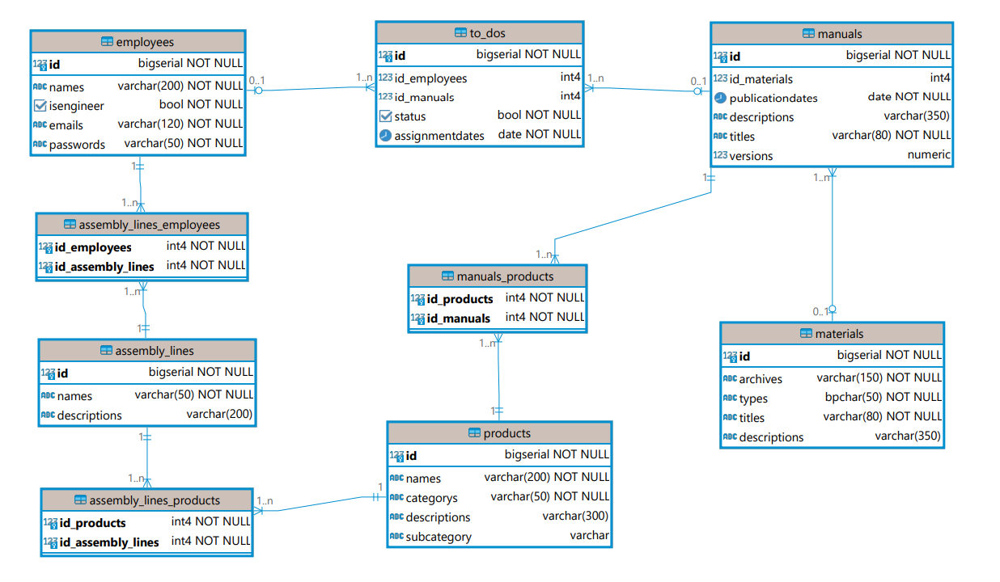

<h1 align="center">Modelagem do banco de dados do Edellcation</h1>
&nbsp;&nbsp;&nbsp;&nbsp;&nbsp;&nbsp;&nbsp;&nbsp;O Edellcation é uma Aplicação WEB criada para proporcionar aos funcionários das linhas de montagem o acesso fácil e eficiente a materiais técnicos e manuais de montagem de produtos da empresa, como computadores, servidores e notebooks. A plataforma permite que os funcionários estudem, revisem e acompanhem os processos de montagem de forma individualizada, ao mesmo tempo em que os mantêm atualizados sobre quaisquer alterações nos procedimentos ou inclusão de novos manuais.

&nbsp;&nbsp;&nbsp;&nbsp;&nbsp;&nbsp;&nbsp;&nbsp;Seu banco de dados foi desenvolvido de acordo com a estrutura do SGBD (Sistema de Gerenciamento de Banco de Dados) PostgreSQL no software SQLDesigner. De acordo com os últimos 3 encontros com parceiros, entendemos que precisaríamos armazenar diversas informações que poderiam ser agrupadas em: funcionários (employees), manuais (manuals), lista de tarefas (to-do), materiais dos manuais (materials), linhas de montagem (assembly_lines) e produtos (products); a partir disso, já entendemos quais são as entidades do nosso banco de dados, pelo pelos neste primeiro momento, porque sabemos que quando a aplicação amadurecer, vamos cada vez mais aprimorar o banco de dados. Abaixo está o modelo físico com cardinalidade, nulabilidade e tipagem de dados:



[Diagrama em PNG](assets/databaseDiagram.png)</br>
[Diagrama em PDF](assets/databaseDiagram.pdf)</br>
[Arquivo da Modelagem (XML)](assets/database.xml) 

## Relacionamentos
- **Funcionários (1,n) - (1,n) Linha de montagem:** Um Funcionários pode trabalhar em várias linhas de montagem enquanto uma linha de montagem pode conter vários operadores trabalhando.
- **Funcionários (x,x) - (x,x) Lista de Tarefas:** lorem ipsum bla bla bla
- **Lista de Tarefas (x,x) - (x,x) Manuais:** lorem ipsum bla bla bla
- **Manuais (x,x) - (x,x) Materiais:** lorem ipsum bla bla bla
- **Manuais (x,x) - (x,x) Produtos:** lorem ipsum bla bla bla
- **Linhas de montagens (x,x) - (x,x) Produtos:** lorem ipsum bla bla bla

Esses relacionamentos foram os pilares sobre os quais construímos nosso banco dados, pilares os quais extraímos do entendimento do negócio do parceiro, sejoa pelos encontros, TAPI, orientaões dos professoures ou deduções. Abaixo está o código funcional testado do banco:

Código SQL:
```sql
DROP TABLE IF EXISTS MANUALS_PRODUCTS CASCADE;
DROP TABLE IF EXISTS ASSEMBLY_LINES_PRODUCTS CASCADE;
DROP TABLE IF EXISTS ASSEMBLY_LINES_EMPLOYEES CASCADE;
DROP TABLE IF EXISTS TO_DOS CASCADE;
DROP TABLE IF EXISTS MANUALS CASCADE;
DROP TABLE IF EXISTS EMPLOYEES CASCADE;
DROP TABLE IF EXISTS ASSEMBLY_LINES CASCADE;
DROP TABLE IF EXISTS PRODUCTS CASCADE;
DROP TABLE IF EXISTS MATERIALS CASCADE;

CREATE TABLE MATERIALS (
    id BIGSERIAL PRIMARY KEY,
    Archives VARCHAR(150) NOT NULL DEFAULT 'NULL', -- Caminho para o material
    Types CHAR(50) NOT NULL DEFAULT 'NULL', -- Campo para informar o tipe do arquivo do manual (PDF, vídeo, modelo 3D, etc)
    Titles VARCHAR(80) NOT NULL DEFAULT 'Sem Título',
    Descriptions VARCHAR(350) DEFAULT 'Sem descrição'
);

COMMENT ON TABLE MATERIALS IS 'Arquivos que serão utilizados nos manuais';
COMMENT ON COLUMN MATERIALS.Archives IS 'Caminho para o material';
COMMENT ON COLUMN MATERIALS.Types IS 'Campo para informar a extensão do arquivo do manual (PDF, vídeo, modelo 3D, etc)';

CREATE TABLE EMPLOYEES (
    id BIGSERIAL PRIMARY KEY,
    Names VARCHAR(200) NOT NULL DEFAULT 'NULL',
    IsEngineer BOOLEAN NOT NULL DEFAULT 'f', -- Campo booleano para definir se é engenheiro ou não
    Emails VARCHAR(120) NOT NULL DEFAULT 'NULL',
    Passwords VARCHAR(50) NOT NULL DEFAULT 'NULL'
);

COMMENT ON TABLE EMPLOYEES IS 'Tabela que armazenará todos os funcionários da empresa, seja engenheiro ou operador de linha de montagem.';
COMMENT ON COLUMN EMPLOYEES.IsEngineer IS 'Campo booleano para definir se é engenheiro ou não';

CREATE TABLE ASSEMBLY_LINES (
    id BIGSERIAL PRIMARY KEY,
    Names VARCHAR(50) NOT NULL DEFAULT 'NULL',
    Descriptions VARCHAR(200) DEFAULT 'Sem descrição'
);

COMMENT ON TABLE ASSEMBLY_LINES IS 'Armazenará as linhas de montagens das quais os funcionários são pertencentes.';

CREATE TABLE PRODUCTS (
    id BIGSERIAL PRIMARY KEY, -- Número de série
    Names VARCHAR(200) NOT NULL DEFAULT 'NULL',
    Categorys VARCHAR(50) NOT NULL DEFAULT 'NULL', -- Exemplo: monitor, notebook, servidor, etc.
    Descriptions VARCHAR(300) DEFAULT 'Sem descrição',
    Subcategory VARCHAR
);

COMMENT ON TABLE PRODUCTS IS 'Equipamentos montados pela Dell';
COMMENT ON COLUMN PRODUCTS.id IS 'Número de série';
COMMENT ON COLUMN PRODUCTS.Categorys IS 'Exemplo: monitor, notebook, servidor, etc.';

CREATE TABLE MANUALS (
    id BIGSERIAL PRIMARY KEY,
    id_MATERIALS INTEGER,
    PublicationDates DATE NOT NULL DEFAULT CURRENT_DATE,
    Descriptions VARCHAR(350),
    Titles VARCHAR(80) NOT NULL DEFAULT 'Sem Título',
    Versions DECIMAL DEFAULT 0.1,
    CONSTRAINT fk_manuals_materials FOREIGN KEY (id_MATERIALS) REFERENCES MATERIALS(id)
);

COMMENT ON TABLE MANUALS IS 'Manuais para o aprendizado da montagem de produtos';

CREATE TABLE TO_DOS (
    id BIGSERIAL PRIMARY KEY,
    id_EMPLOYEES INTEGER,
    id_MANUALS INTEGER,
    Status BOOLEAN NOT NULL DEFAULT 'f', -- Campo booleano para definir se a tarefa foi concluída ou não
    AssignmentDates DATE NOT NULL DEFAULT CURRENT_DATE,
    CONSTRAINT fk_to_dos_employees FOREIGN KEY (id_EMPLOYEES) REFERENCES EMPLOYEES(id),
    CONSTRAINT fk_to_dos_manuals FOREIGN KEY (id_MANUALS) REFERENCES MANUALS(id)
);

COMMENT ON TABLE TO_DOS IS 'Lista de manuais a serem lidos pelo funcionário';
COMMENT ON COLUMN TO_DOS.Status IS 'Campo booleano para definir se a tarefa foi concluída ou não';

CREATE TABLE ASSEMBLY_LINES_EMPLOYEES (
    id_EMPLOYEES INTEGER,
    id_ASSEMBLY_LINES INTEGER,
    PRIMARY KEY (id_EMPLOYEES, id_ASSEMBLY_LINES),
    CONSTRAINT fk_assembly_lines_employees FOREIGN KEY (id_EMPLOYEES) REFERENCES EMPLOYEES(id),
    CONSTRAINT fk_assembly_lines FOREIGN KEY (id_ASSEMBLY_LINES) REFERENCES ASSEMBLY_LINES(id)
);

COMMENT ON TABLE ASSEMBLY_LINES_EMPLOYEES IS 'Intermédio entre as tabelas de linha de montagem e a tabela de funcionários por conta da relação n para n';

CREATE TABLE ASSEMBLY_LINES_PRODUCTS (
    id_PRODUCTS INTEGER,
    id_ASSEMBLY_LINES INTEGER,
    PRIMARY KEY (id_PRODUCTS, id_ASSEMBLY_LINES),
    CONSTRAINT fk_manuals_products FOREIGN KEY (id_PRODUCTS) REFERENCES PRODUCTS(id),
    CONSTRAINT fk_manuals_assembly_lines FOREIGN KEY (id_ASSEMBLY_LINES) REFERENCES ASSEMBLY_LINES(id)
);

COMMENT ON TABLE ASSEMBLY_LINES_PRODUCTS IS 'Intermédio entre as tabelas de linhas de montagem e a tabela de produtos por conta da relação n para n';

CREATE TABLE MANUALS_PRODUCTS (
    id_PRODUCTS INTEGER,
    id_MANUALS INTEGER,
    PRIMARY KEY (id_PRODUCTS, id_MANUALS),
    CONSTRAINT fk_assembly_lines_products FOREIGN KEY (id_PRODUCTS) REFERENCES PRODUCTS(id),
    CONSTRAINT fk_assembly_lines_manuals FOREIGN KEY (id_MANUALS) REFERENCES MANUALS(id)
);

COMMENT ON TABLE MANUALS_PRODUCTS IS 'Intermédio entre as tabelas de manuais e a tabela de produtos por conta da relação n para n';
```